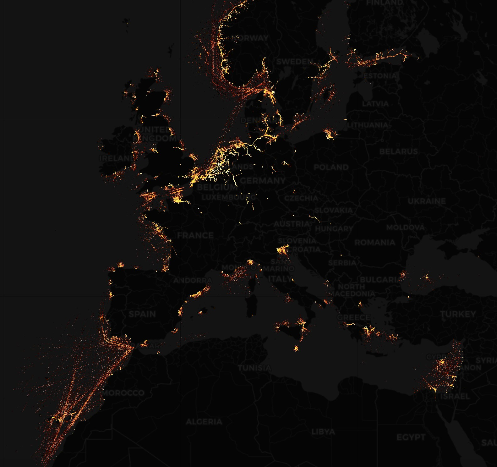

# Stuart Allison

### US Navy Civil Engineer Corps (CEC) Officer

**Interested In:** Data Analysis, AI/ML, Data Visualization, Architecture, Infrastructure

**Skills:** Python and R Data Analysis, Web Dashboards, Design and Construction Planning, Project Management

## Contact Me
- **Email:** stuart.g.allison@gmail.com

## Education
- MS, Operations Research | Naval Postgraduate School (projected_2026_)
- BS, Architecture | Texas Tech University (2008)

## Work Experience
**Student**           
Naval Postgraduate School     
(_June 2024 - present_)
- Military student in the Operations Analysis curriculum within the Operations Research department.
- Also serves as Global Resilience and Security Senior Fellow. 

## Projects

### Near-Live AIS Tracking
[Git Repo](https://github.com/stalliso/OA3802_FinalProject)

Designed and developed a visualization to track ships with near-live data via AIS locations.

